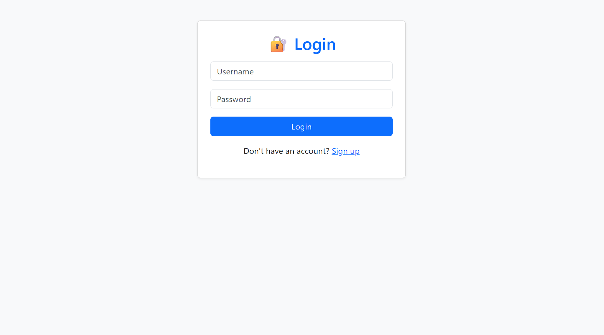
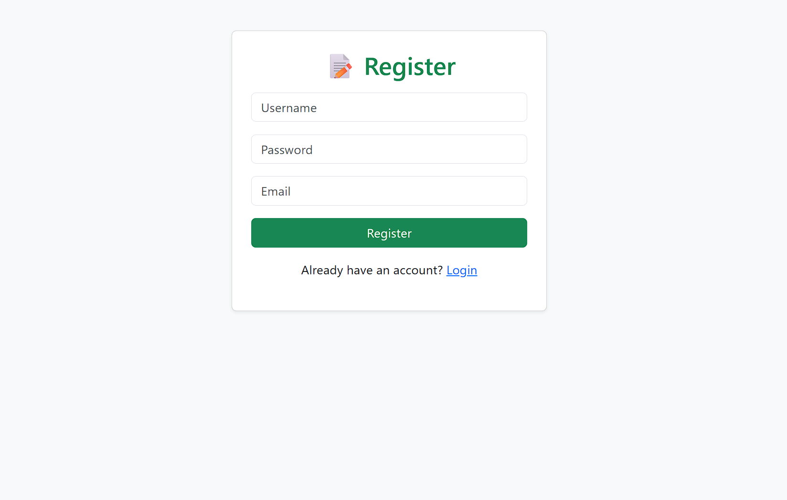
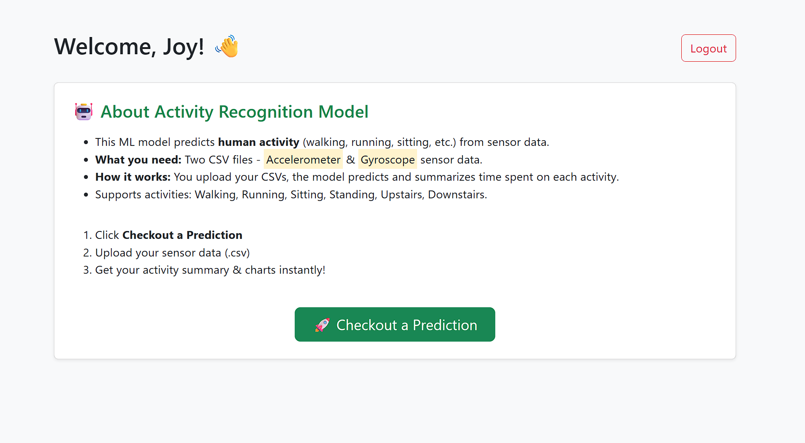
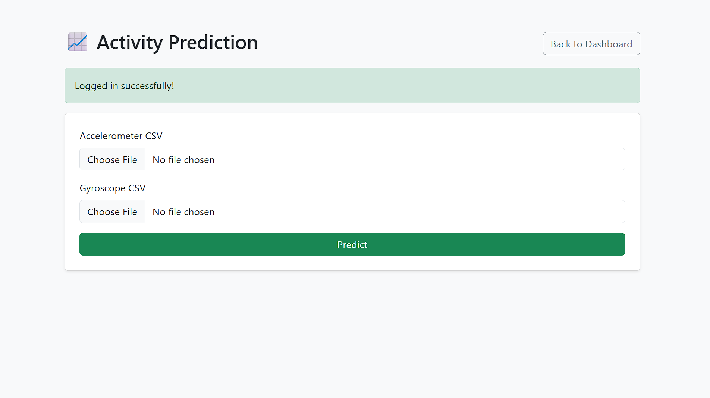

# ActionGuardians

&#x20;&#x20;

> **End-to-End Human Activity Recognition** using smartphone accelerometer & gyroscope data

---

## 📌 Table of Contents

1. [Project Overview](#project-overview)
2. [Pipeline Architecture](#pipeline-architecture)
3. [Results](#results)
4. [Demo](#demo)
5. [Installation & Usage](#installation--usage)
6. [Project Structure](#project-structure)
7. [Future Work](#future-work)
8. [Contributing](#contributing)
9. [License](#license)

---

## 🚀 Project Overview

**Objective**: Real-time recognition of six human activities—walking, running, sitting, standing, upstairs, downstairs—from smartphone sensor data.

* **Dataset**

  * **Source**: Self-collected (50 Hz sampling rate)
  * **Features**: `acc_x`, `acc_y`, `acc_z`, `gyro_x`, `gyro_y`, `gyro_z`
  * **Samples**: \~2,500 sliding-window instances (Test set: 115 windows)
  * **Labels**: 6 balanced classes

---

## 🛠 Pipeline Architecture

### 1. Data Collection

* Raw CSV with columns: `id`, `timestamp`, `seconds_elapsed`, sensor axes, `label`.

### 2. Preprocessing

* **DataPreprocessor** class:

  * Cleans unwanted columns
  * Generates sliding windows (`window_size`, `step_size`)
  * Assigns dominant label per window

### 3. Feature Extraction

* **Time-domain**: mean, std, min, max, median, energy
* **Jerk**: Δsignal × sampling\_rate (mean, std, energy)
* **Zero crossings** count
* **Frequency-domain**: FFT (mean, max, std)

### 4. Model Training

* **Algorithm**: `RandomForestClassifier`
* **Hyperparameters**: `n_estimators=100`, `max_depth=None`, `random_state=42`
* **Tracking**: MLflow for experiment logging & artifact storage

### 5. Deployment

* **FastAPI** server:

  * Endpoint: `/predict` (accepts two CSVs, returns JSON summary)
* **Flask** UI:

  * User authentication & session management
  * CSV upload interface
  * Interactive summary charts & tables

---

## 📈 Results

| Metric    | Value |
| --------- | ----- |
| Accuracy  | 1.00  |
| Precision | 1.00  |
| Recall    | 1.00  |
| F1-Score  | 1.00  |

**Confusion Matrix (Test Set)**&#x20;

---

<!-- ## 🎬 Demo

[](https://youtu.be/<VIDEO_ID>) -->

## 🖥️ UI Screenshots

#### Login Page



#### Registration Page



#### Dashboard Home



#### Activity Prediction Form



#### Prediction Summary


## 💻 Installation & Usage

1. **Clone the repo**

   ```bash
   git clone https://github.com/<username>/ActionGuardians.git
   cd ActionGuardians
   ```

2. **Install dependencies**

   ```bash
   pip install -r requirements.txt
   ```

3. **Preprocess & Train**

   ```bash
   python scripts/preprocess.py    # Generates X_windows.npy & y_labels.npy
   python scripts/train.py         # Trains model and logs to MLflow
   ```

4. **Start FastAPI**

   ```bash
   uvicorn api.main:app --reload
   ```

5. **Launch Flask UI**

   ```bash
   cd ui
   flask run
   ```

6. **Access Dashboard**

   * Visit `http://localhost:5000`
   * Login default: `admin` / `password123` (change in `.env`)

---

## 📂 Project Structure

```
ActionGuardians/
├── __pycache__/            # Python bytecode cache
├── config/                # Global configuration files
├── images/                # Visual assets (plots, diagrams, screenshots)
├── logs/                  # Log files
├── notebooks/             # Jupyter notebooks
├── services/              # Background services or utility scripts
├── src_actionguardian/    # Core application source code
│   ├── __pycache__/       # Cached Python files
│   ├── components/        # UI components (Flask templates logic)
│   ├── config/            # Application-specific configs
│   ├── constants/         # Constant definitions
│   ├── entity/            # Data models and schemas
│   ├── pipeline/          # Preprocessing & training pipeline code
│   └── utils/             # Utility functions
├── static/                # Static assets (CSS, JS)
├── templates/             # HTML templates
│   ├── dashboard.html
│   ├── index.html
│   ├── login.html
│   ├── predict.html
│   └── register.html
├── venv/                  # Virtual environment
├── .env                   # Environment variables
├── .gitignore             # Git ignore rules
├── app.py                 # Flask UI entrypoint
├── fast_api_server.py     # FastAPI server entrypoint
├── main.py                # Orchestrator script (if used)
├── params.yaml            # Parameter definitions for pipelines
├── schema.yaml            # Data schema definitions
├── schemas.py             # Pydantic schemas
├── template.py            # Template utilities
├── requirements.txt       # Python dependencies
└── README.md              # Project documentation
```

<!-- ---

## 🔮 Future Work

* Data augmentation: noise injection, rotation, scaling
* Deep learning: CNN/LSTM experiments
* Mobile-app integration: real-time inference
* CI/CD pipeline: GitHub Actions → Docker → AWS/GCP

--- -->

## 🤝 Contributing

Contributions welcome! Please open issues and PRs for improvements, features, or bug fixes.

---

## 📜 License

This project is licensed under the MIT License. See [LICENSE](LICENSE) for details.
